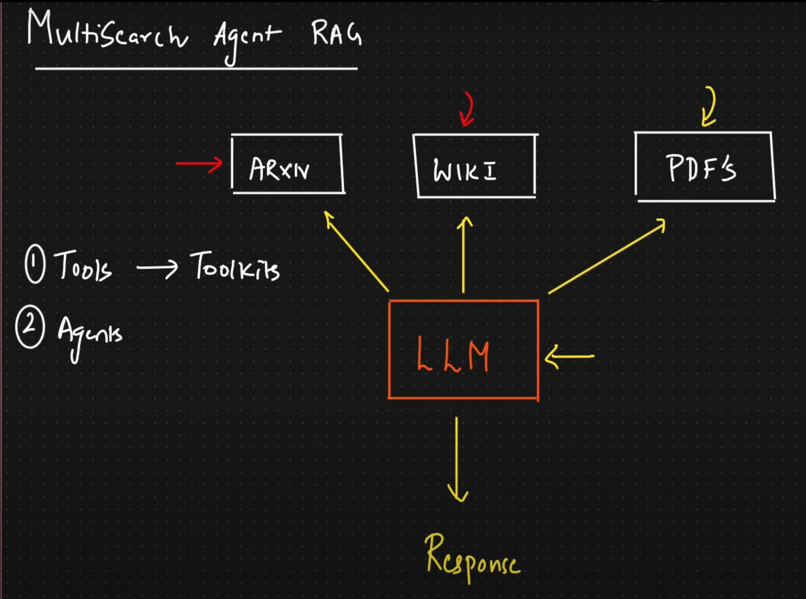
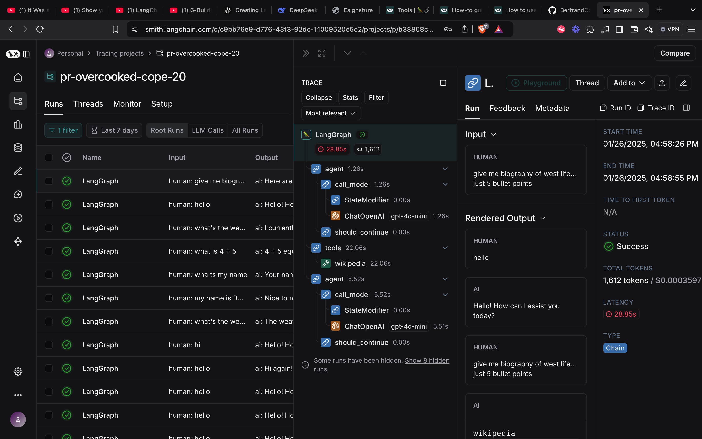
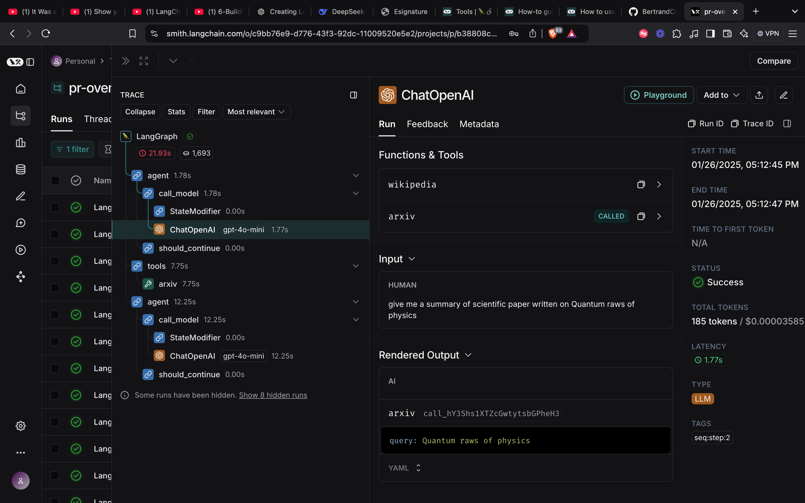
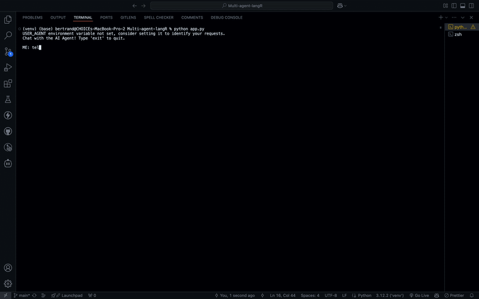

# LangR-multi-agent

This is reporter agent built with LangGraph. It uses wikipedia, arxiv and custom document retriever tools to complete tasks. Additionally, LangSmith is used to monitor and debug every user interaction.

## Features
- **Tools:** It makes use of Wikipedia and Arxiv for research and gathering information.
- **RAG System:** Combines retrieval from document embeddings and OpenAI's LLM to provide context-specific answers.
- **LangSmith Monitoring:** Tracks and analyzes all interactions to improve the chatbot's performance and reliability.

## Prerequisites
Before running the application, ensure you have the following:

1. Python 3.8 or later
2. Required Python libraries:
   - `langGraph`
   - `Wikipedia`
   - `Arxiv`
   - `langchain-community`
   - `faiss-cpu`
   - `langchain`
   - `langchain-openai`
   - `langsmith`

## Folder Structure
- **`app.py`**: Main application file.
- **`tools.py`**: Defining tools for the agent

## How to Run

1. Clone the repository:

   ```bash
   git clone https://github.com/BertrandConxy/langR-multi-agent.git
   cd langR-multi-agent
   ```
2. Create virtual env
   ```bash
   python -m venv venv
   ```
3. Install the dependencies using:

   ```bash
   pip install -r requirements.txt
   ```
4. Create `.env` file for credentials
   ```
   OPENAI_API_KEY
   LANGSMITH_TRACING=True
   LANGSMITH_ENDPOINT
   LANGSMITH_API_KEY
   LANGSMITH_PROJECT
   ```
5. Run the app:

   ```bash
   python app.py
   ```

## Demo





## What's Next
- Persisting custom knowledge documents locallly so that it doesn't take long for embeddings.

## Monitoring with LangSmith
LangSmith is integrated into this project to monitor and analyze chatbot interactions. This ensures the app remains robust and user-friendly. To configure LangSmith:

1. Set up your LangSmith account and API key.
2. Ensure the `LANGSMITH_API_KEY` is added to your environment variables.